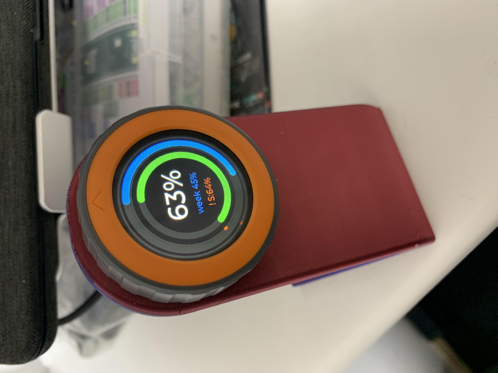
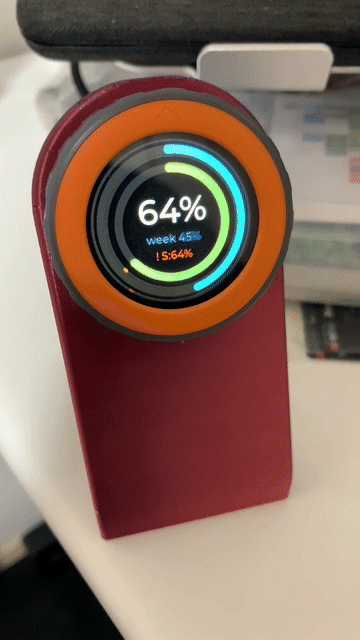

# Clawdial

**[English README is here](README.md)**

> インスパイア元: [Clawdmeter](https://github.com/HermannBjorgvin/Clawdmeter) by [@HermannBjorgvin](https://github.com/HermannBjorgvin)。
> レートリミットヘッダーのポーリング方式は同プロジェクトを参考にしています。

M5Stack Dial（ESP32-S3）上で動く **Claude Code 使用量モニター**。

デスクに置くだけ。セッション・週間の API 使用率をリアルタイム表示し、閾値に近づくとダブルビープ、到達すると継続的な警告音で知らせます。ダイヤルを回して閾値をその場で調整できます。

<table role="presentation"><tr>
<td></td>
<td></td>
</tr></table>

---

## 台座

3Dプリント台座を使うと、USBポートを下にした状態でダイヤルを自立させられます。

> 🖨️ 台座データ: [MakerWorld: M5Stack Dial Rotary Knob Stand](https://makerworld.com/ja/models/763395-m5stack-dial-rotary-knob-stand) by [DaNi 3D Lab](https://makerworld.com/en/@DaNi3DLab) — ありがとうございます！

台座を使う場合は、タッチ長押しで向きをトグルできます（デフォルトは「USB下」）。

---

## ハードウェア

| 項目 | 内容 |
|------|------|
| ボード | M5Stack Dial v1.1 |
| MCU | ESP32-S3（M5StampS3） |
| 画面 | 1.28インチ 丸型IPS LCD 240×240 |
| 入力 | ロータリーエンコーダ + タッチ |
| 接続 | BLE 5.0 |

---

## 構成

```
Clawdial/
├── firmware/   PlatformIO プロジェクト（M5Stack Dial 用ファームウェア）
└── daemon/     PC 側デーモン（Go、Windows / macOS / Linux）
```

---

## 必要要件

| 項目 | 要件 |
|------|------|
| [PlatformIO](https://platformio.org/) | ファームウェアのビルド・書き込み |
| [Go 1.26+](https://go.dev/dl/) | デーモンのビルド |
| [Claude Code](https://claude.ai/code) | 認証情報の生成（`claude login`） |
| Bluetooth LE 5.0 対応アダプタ | PC 側 BLE 通信 |

---

## セットアップ

### ファームウェア

**1. VS Code と PlatformIO をインストール**

1. [Visual Studio Code](https://code.visualstudio.com/) をインストール
2. 拡張機能パネル（`Ctrl+Shift+X`）で **PlatformIO IDE** を検索してインストール
3. 促されたら VS Code を再起動

**2. ファームウェアを書き込む**

1. M5Stack Dial を USB-C ケーブルで PC に接続
2. VS Code でこのリポジトリのフォルダを開く（`ファイル → フォルダを開く`）
3. 左サイドバーの **PlatformIO アイコン**（エイリアンのアイコン）をクリック
4. `m5stack-stamps3 → General` の **Upload** をクリック
5. ターミナルに `SUCCESS` が出たら完了（初回は toolchain のダウンロードで1分ほどかかります）

> **ポートが見つからない場合**： Windows では [CP210x USB ドライバ](https://www.silabs.com/developers/usb-to-uart-bridge-vcp-drivers) が必要なことがあります。インストール後、ケーブルを差し直してください。

書き込み完了後は USB を抜いてかまいません。通常使用は USB-C 給電（充電器など）＋ BLE 通信です。

### デーモン（PC側）

**事前準備：** [Claude Code](https://claude.ai/code) をインストールし、`claude login` でログインしておいてください。

インストールスクリプトを使う方法（推奨）：

```
# Windows: install.bat をダブルクリック、またはターミナルで実行
daemon\install.bat

# macOS / Linux（未テスト・近日対応予定）
chmod +x daemon/install.sh
./daemon/install.sh
```

手動でビルドする場合：

```bash
cd daemon
go build -o clawdial-daemon .
./clawdial-daemon        # Linux / macOS（未テスト）
clawdial-daemon.exe      # Windows
```

> **macOS / Linux:** ビルド・起動は可能ですが、動作未検証です。近日中にテスト予定です。

> **トークン消費について**
> デーモンはポーリングのたびに `claude-haiku-4-5-20251001` へ 1 トークンのAPIコールを行い、レスポンスのレートリミットヘッダーから使用率を取得します。デフォルトの 60 秒間隔では約 $0.03/日 の消費で、通常の Claude Code 利用と比べると誤差の範囲です。

デーモンは **起動したままにしておく必要があります**。
`install.bat` / `install.sh` のスタートアップ登録オプションを使うと PC 起動時に自動起動します。

> **Windows:** デーモンはコンソールウィンドウなしで動作します（`-H=windowsgui` ビルド）。タスクトレイのアイコンとしてのみ表示されます。インストーラ（`install.bat`）は一時的にコンソールウィンドウを開きますが、インストール完了後に閉じます。

> **認証の有効期限について**
> Claude Code の認証トークンは数時間で失効します。デーモンが 401 エラーを出した場合は `claude login` を再実行してください。

**設定（任意）**

`daemon/.env.example` を `daemon/.env` にコピーして編集してください。

```env
CLAWDIAL_DEVICE_NAME=Clawdial    # BLE デバイス名（ファームウェアと合わせる）
CLAWDIAL_POLL_INTERVAL=60        # ポーリング間隔（秒）
CLAWDIAL_SCAN_TIMEOUT=15         # BLE スキャンタイムアウト（秒）
```

> **設定の変更はデーモン再起動後に反映されます。** Windows では Quit → 再起動してください（システムトレイの **Open Config** のツールチップにも記載されています）。

---

## 操作方法

### 警告リミットの設定

ロータリーダイヤルがこのデバイスの核心です。アプリも設定ファイルも不要で、本体だけで警告閾値をリアルタイムに変更できます。

1. タッチを**短押し**して編集対象を選ぶ — **セッション**または**週間**（選択中はディスプレイ上でハイライト表示）
2. **ダイヤルを回して**閾値を **±1% ずつ**上下に調整
3. 設定値は**操作を止めてから約1秒後に不揮発性ストレージ（NVS）へ保存** — 電源を切っても再起動しても維持され、reflash 不要（調整直後の電源断には注意）

> **例：** セッションリミットを 80% に設定 → 75% で短いビープ音、80% 到達で画面赤フラッシュ＋連続ビープ

### 操作一覧

| 操作 | 動作 |
|------|------|
| ダイヤル回転 | 編集中のリミット値を ±1% |
| タッチ（短押し） | 編集対象をセッション / 週間で切り替え |
| タッチ（警告中） | 警告音をミュート |
| タッチ（1秒長押し） | 画面を180°反転して再起動 |

### 画面の向き

向き設定は NVS（不揮発性ストレージ）に保存されるため、電源を切っても維持されます。reflash は不要です。

| 向き | 用途 |
|------|------|
| USB下（デフォルト） | 3Dプリント台座使用時 |
| USB上 | ケーブル吊り下げ / USB直差し |

タッチを1秒長押しすると向きが切り替わり、ビープ音の後に自動で再起動します。

---

## 警告動作

| 使用率 | 動作 |
|--------|------|
| リミット −5% | ピピッ（初回のみ） |
| リミット到達 | 画面赤フラッシュ + ピーピー繰り返し |
| タッチ | 警告音をミュート（使用率がリミット以下に戻るまで） |

---

## BLE プロトコル

Clawdial 固有の UUID を使用しています（RFC 4122 v4、ベース `29590732-a70c-4ea9-a739-…`）。

| 項目 | UUID |
|------|------|
| Service | `29590732-a70c-4ea9-a739-000000000001` |
| RX Characteristic (write) | `29590732-a70c-4ea9-a739-000000000002` |
| TX Characteristic (notify) | `29590732-a70c-4ea9-a739-000000000003` |

JSON ペイロード（daemon → device）:

```json
{ "s": 45, "sr": 120, "w": 28, "wr": 7200, "pi": 60, "ok": true, "st": false }
```

| フィールド | 意味 |
|-----------|------|
| `s` | セッション使用率 (%) |
| `sr` | セッションリセットまでの時間 (分) |
| `w` | 週間使用率 (%) |
| `wr` | 週間リセットまでの時間 (分) |
| `pi` | ポーリング間隔（秒）— デバイスがオフライン判定タイムアウトを動的算出するために使用（`pi×2+30s`）|
| `ok` | 取得成功フラグ（`false` = トークンエラー → 即オフライン画面）|
| `st` | 古い値フラグ — レート制限中など前回cached値を送るとき `true`。デバイスはゲージ色を暗くして表示 |

---

## ライセンス

MIT — [LICENSE](LICENSE) 参照。

[Clawdmeter](https://github.com/HermannBjorgvin/Clawdmeter) にインスパイアされています。レートリミットヘッダーのポーリング方式は同プロジェクトを参考にしています。
